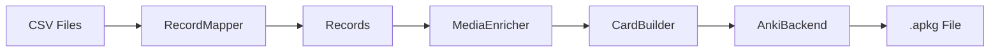

# System Architecture Overview

**Document Type**: High-Level Architecture  
**Purpose**: Explain system architecture, design decisions, and component interactions  
**Audience**: Architects, Senior Engineers, Technical Leaders

## Executive Summary

The Anki German Language Deck Generator implements **Clean Pipeline Architecture** to transform CSV vocabulary data into production-ready Anki flashcard decks. The system is designed for extensibility, with German A1 as the first implementation and architecture ready for multi-language support.

### Key Achievements
- **Clean Architecture**: Enterprise-grade separation of concerns
- **Modern Python**: All domain models migrated to dataclasses with protocol compliance
- **Type Safety**: 100% MyPy strict compliance (0 errors in 98 source files)
- **Quality**: 595 tests passing with comprehensive coverage
- **Production Ready**: Successfully deployed with complete German A1 support
- **Protocol Compliance**: Formal MediaGenerationCapable implementation across all models

## Architectural Principles

1. **Clean Architecture**: Clear separation between domain, application, and infrastructure layers
2. **Single Responsibility**: Each component has one well-defined purpose
3. **Dependency Inversion**: High-level modules depend on abstractions
4. **Open/Closed**: System is open for extension, closed for modification
5. **Type Safety**: Comprehensive type annotations with strict validation

## System Layers

### 1. Domain Layer
**Location**: `src/langlearn/models/`  
**Responsibility**: Core business logic and German language rules

- **Records**: Lightweight Pydantic DTOs for data transport and validation
- **Domain Models**: Rich dataclass models with MediaGenerationCapable protocol
- **Validation**: Modern Python patterns with inline __post_init__ validation
- **German Expertise**: SMART domain models containing linguistic knowledge

### 2. Application Layer
**Location**: `src/langlearn/services/`  
**Responsibility**: Business logic orchestration and use cases

- **RecordMapper**: CSV to Record transformation
- **MediaEnricher**: Audio and image generation
- **CardBuilder**: Record to Anki card formatting
- **External Services**: API integrations (AWS, Pexels, Anthropic)

### 3. Infrastructure Layer
**Location**: `src/langlearn/backends/`  
**Responsibility**: External system integration

- **AnkiBackend**: Official Anki library integration
- **DeckBackend**: Abstract interface for deck generation
- **Media Storage**: File system management

### 4. Presentation Layer
**Location**: `src/langlearn/templates/`  
**Responsibility**: User-facing card templates

- **HTML Templates**: Card front/back layouts
- **CSS Styling**: Visual presentation
- **JavaScript**: Interactive elements (if needed)

## Architectural Patterns

### Clean Pipeline Architecture
```
CSV → RecordMapper → Records → MediaEnricher → CardBuilder → AnkiBackend → .apkg
```

Each step has a single responsibility:
- **RecordMapper**: Data transformation
- **Records**: Data validation and transport
- **MediaEnricher**: Media generation and caching
- **CardBuilder**: Card formatting and field mapping
- **AnkiBackend**: Deck file generation

### Dependency Injection
```python
class AnkiBackend:
    def __init__(self, 
                 media_enricher: MediaEnricher | None = None,
                 card_builder: CardBuilder | None = None):
        # Dependencies injected, not created
        self._media_enricher = media_enricher or MediaEnricher()
        self._card_builder = card_builder or CardBuilder()
```

### Strategy Pattern
```python
class DeckBackend(ABC):
    @abstractmethod
    def create_deck(self, name: str) -> Deck:
        pass

class AnkiBackend(DeckBackend):
    def create_deck(self, name: str) -> Deck:
        # Official Anki implementation
        
class GenankiBackend(DeckBackend):
    def create_deck(self, name: str) -> Deck:
        # Genanki implementation
```

## Data Flow

### Primary Pipeline


### Service Interactions

1. **CSV Loading**: `CSVService` reads vocabulary data
2. **Record Creation**: `RecordMapper` creates typed records
3. **Media Generation**: 
   - `AudioService` → AWS Polly for pronunciation
   - `PexelsService` → Images for visual learning
   - `AnthropicService` → AI-enhanced search queries
4. **Card Building**: `CardBuilder` formats for Anki
5. **Deck Creation**: `AnkiBackend` generates .apkg file

## Quality Attributes

### Performance
- **Caching**: Hash-based media caching prevents duplicate generation
- **Existence Checking**: Skip generation for existing files
- **Batch Processing**: Efficient handling of large vocabularies
- **Lazy Loading**: Services instantiated only when needed

### Maintainability
- **Clean Boundaries**: Each component has clear interfaces
- **High Cohesion**: Related functionality grouped together
- **Low Coupling**: Components interact through abstractions
- **Testability**: 813 tests with comprehensive coverage

### Extensibility
- **New Word Types**: Add without modifying existing code
- **Language Support**: Architecture supports multi-language
- **Media Sources**: Pluggable media generation services
- **Export Formats**: Abstract backend supports multiple outputs

### Reliability
- **Type Safety**: 100% MyPy strict compliance
- **Error Handling**: Graceful degradation with fallbacks
- **Validation**: Pydantic models ensure data integrity
- **Testing**: Comprehensive unit and integration tests

## Technology Stack

### Core Technologies
- **Python 3.10+**: Modern Python with type hints
- **Pydantic 2.0**: Data validation and settings
- **Official Anki Library**: Direct .apkg generation
- **Hatch**: Project and dependency management

### External Services
- **AWS Polly**: German text-to-speech
- **Pexels API**: Vocabulary images
- **Anthropic Claude**: AI-enhanced search

### Development Tools
- **MyPy**: Static type checking (strict mode)
- **Ruff**: Linting and formatting
- **Pytest**: Testing framework
- **Coverage.py**: Code coverage analysis

## Deployment Architecture

### Local Development
```bash
# Install dependencies
hatch env create

# Run application
hatch run app
```

### Production Deployment
- **Standalone Script**: Direct Python execution
- **Docker Container**: Containerized deployment (planned)
- **Web Service**: FastAPI integration (future)

### Configuration Management
- **API Keys**: System keyring for secure storage
- **Environment Variables**: AWS credentials
- **Config Files**: Template paths and settings

## Future Architecture

### Multi-Language Support
```python
class LanguageProcessor(Protocol):
    def validate_grammar(self, text: str) -> bool: ...
    def get_audio_voice(self) -> str: ...
    def get_template_path(self) -> Path: ...

class GermanProcessor(LanguageProcessor):
    # German-specific implementation
    
class RussianProcessor(LanguageProcessor):
    # Russian-specific implementation
```

### Planned Enhancements
1. **Plugin Architecture**: Dynamic loading of word processors
2. **Streaming Pipeline**: Handle large CSV files efficiently
3. **Parallel Processing**: Concurrent media generation
4. **Cloud Integration**: AWS Lambda deployment option

### Extension Points
- **New Word Types**: Implement BaseRecord subclass
- **Media Sources**: Add new service implementations
- **Export Formats**: Extend DeckBackend interface
- **Languages**: Create language-specific processors

---

## Architecture Decision Records (ADRs)

### ADR-001: Clean Pipeline Architecture
**Decision**: Use pipeline architecture with clear separation of concerns  
**Rationale**: Enables testing, maintainability, and extensibility  
**Consequences**: More classes but clearer responsibilities

### ADR-002: Pydantic for Validation
**Decision**: Use Pydantic models for all data validation  
**Rationale**: Type safety, automatic validation, serialization support  
**Consequences**: Dependency on Pydantic, learning curve for team

### ADR-003: Official Anki Library
**Decision**: Use official Anki library instead of genanki  
**Rationale**: Better compatibility, more features, official support  
**Consequences**: More complex API, larger dependency

---

*This architecture provides a solid foundation for extensible, maintainable flashcard generation with clear separation of concerns and comprehensive quality controls.*